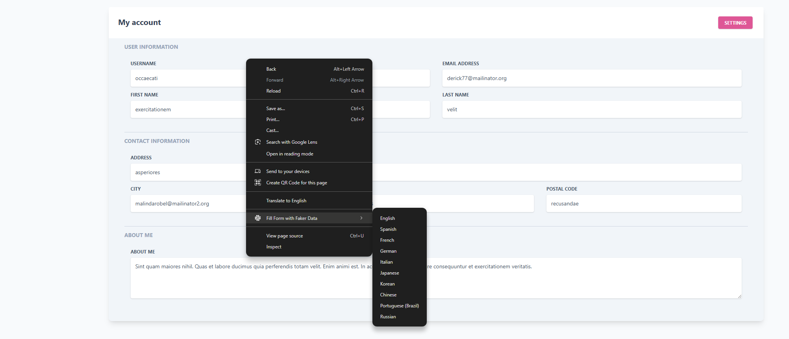
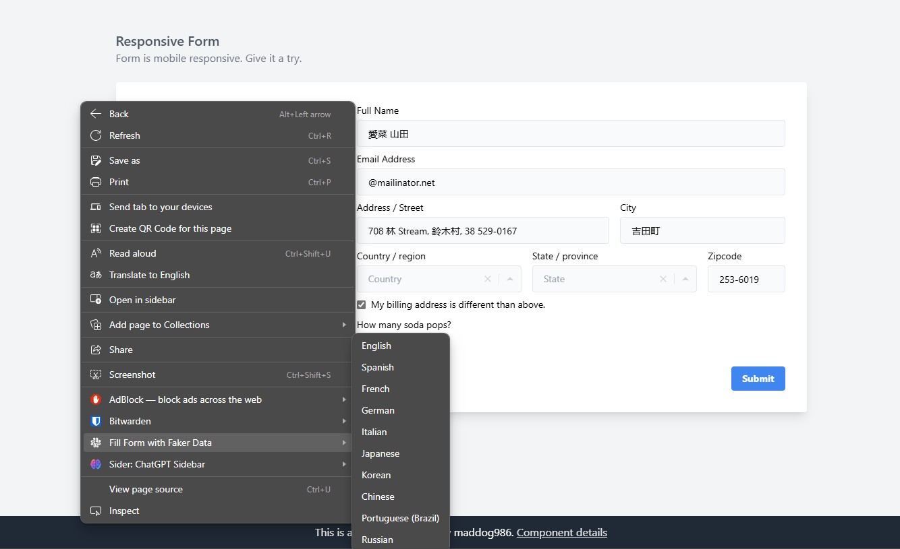

# Form Auto Fill Chrome Extension v1.5

A Chrome/Edge extension that automatically fills forms with realistic fake data using Faker.js.

<p align="center">
   
   
</p>

## What is this?

This Chrome/Edge extension is like a magic wand for filling out online forms. Instead of typing in your information, it automatically fills the form fields with realistic-looking fake data. It's great for testing websites, creating demo accounts, or just saving time when you don't want to enter your real information.

## How does it work?

The extension uses a library called Faker.js to generate the fake data. When you right-click on a webpage and select "Fill Form with Faker Data", the extension identifies the form fields and fills them with appropriate fake data, such as names, email addresses, phone numbers, and addresses.

Here's how the extension detects the type of data to fill in each field:

```javascript
// Example from field-detection.js
function detectFieldType(field) {
  const name = field.name.toLowerCase();
  const id = field.id.toLowerCase();
  const placeholder = field.placeholder.toLowerCase();

  if (name.includes('first') || id.includes('first') || placeholder.includes('first')) {
    return 'firstName';
  }
  // ... other field type detections
}
```

## How to use it?

1.  Navigate to any webpage with a form.
2.  Right-click anywhere on the page.
3.  Select "Fill Form with Faker Data" from the context menu.
4.  The form fields will be automatically filled with realistic data.

## Installation (Developer Mode)

1. Clone or download this repository
2. Install dependencies:
   ```bash
   npm install
   ```
3. Build the extension:
   ```bash
   npm run build
   ```
4. Open Chrome and go to `chrome://extensions/`
5. Enable "Developer mode" in the top right
6. Click "Load unpacked" and select this directory
7. The extension should now appear in your Chrome toolbar

The extension uses a custom icon in the Chrome toolbar.

## Test the Extension

1. Open the included `test.html` file in Chrome
2. Right-click anywhere on the page
3. Select "Fill Form with Faker Data" from the context menu
4. All form fields should be filled with realistic fake data

## Supported Field Types

- First Name
- Last Name
- Email
- Phone Number
- Company Name
- Street Address
- City
- State
- Zip Code
- Generic Text (for unrecognized fields)

## Supported Languages

The extension supports form filling with localized data for the following languages/regions:

- German (Germany, Austria, Switzerland)
- English (US, UK, Australia, Canada, Ireland, India)
- Spanish (Spain, Mexico)
- French (France, Canada)
- Italian
- Japanese
- Korean
- Chinese (China, Taiwan)
- Dutch
- Polish
- Portuguese (Brazil)
- Russian
- Swedish
- Turkish
- Vietnamese
- And more...

Each locale provides region-specific formatting for:
- Date formats
- Phone numbers
- Postal codes
- Address formats
- Name patterns

Here's how the extension uses locale-specific data:

```javascript
// Example from locales.js
const locales = {
  'de-DE': {
    firstName: ['Max', 'Anna'],
    lastName: ['Müller', 'Schmidt'],
    // ... other locale data
  },
  // ... other locales
};
```

## Building the Extension

1. Install Terser for JavaScript minification:
   ```bash
   npm install -g terser
   ```

2. Run the build script:
   ```bash
   ./build.sh
   ```

3. The built files will be in the `dist/` directory
4. A production zip file `form-auto-fill.zip` will be created

## Development

To modify and test the extension:

1. Make your changes to the source files:
   - `background.js` - Background service worker
   - `content.js` - Content script logic
   - `faker.js` - Faker library
   - `locales.js` - Localization data

2. Rebuild the extension:
   ```bash
   ./build.sh
   ```

3. Reload the extension in Chrome:
   - Go to `chrome://extensions/`
   - Click the refresh icon on the Form Auto Fill extension

4. Test your changes using the included `test.html` file

The extension consists of the following files:

- `manifest.json` - Extension configuration
- `background.js` - Handles context menu creation and click events
- `content.js` - Contains form filling logic
- `faker.js` - The Faker.js library for generating fake data
- `test.html` - A test form to demonstrate the extension
- v1.1: Fixed message passing issue and added scripting permission

The main logic for filling the form is in `content.js`:

```javascript
// Example from content.js
chrome.runtime.onMessage.addListener(function(request, sender, sendResponse) {
  if (request.message === "fillForm") {
    fillForm();
  }
});

function fillForm() {
  const form = document.querySelector('form');
  const inputs = form.querySelectorAll('input, textarea, select');

  inputs.forEach(input => {
    const fieldType = detectFieldType(input);
    const fakeData = generateFakeData(fieldType);
    input.value = fakeData;
  });
}
```

## Changelog

### v1.5
- Added comprehensive language support documentation
- Improved locale-specific data formatting
- Enhanced date and time field detection

### v1.4
- Added support for number, date, color and password input fields
- Implemented dynamic module loading
- Enhanced form filling capabilities
- Added additional language support
- Improved locale configurations

### v1.3
- Initial release with basic form filling capabilities
